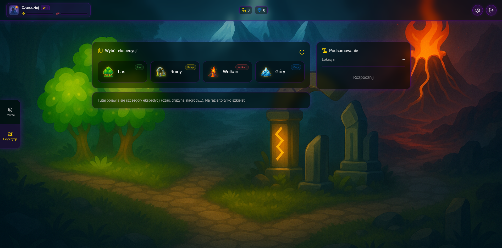
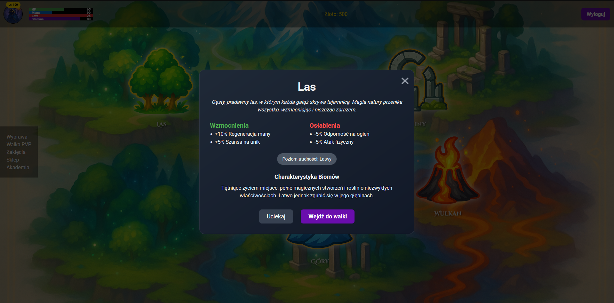
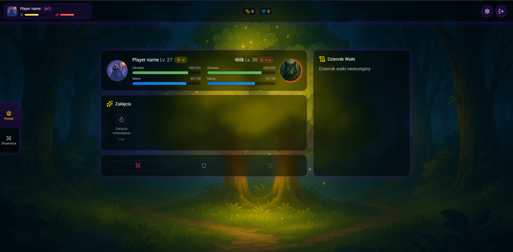

# Arcathoria Client

> Web client for the Arcathoria game built with React and Vite |
> Backend: [Arcathoria API](https://github.com/KrzychuuWEB/arcathoria-api)

---

**Current client version is not fully connected to the API (the API has a new response for exceptions) I working on new
client version with typescript**

## Description

Web client for the Arcathoria game built with React and Vite (SPA). In the game player can login, register, create
character, select character and init PvE combat and perform melee attack. I want to develop new features in the future.
My first step is a migrate from plain Javascript to Typescript.

## Features

- **Authentication:** Sign up and log in using JWT-based authentication
- **Character Management:** Create and select character
- **Combat Interface:** Initiate PvE Combat and perform attack
- **Form Validation:** Built with Formik and Yup
- **Notifications:** Real-time feedback with React Toastify
- **Progress Indicators:** Page loading indicators via `@tanem/react-nprogress`

## Coming soon features

- **Level system**
- **Skills system**
- **Reward system**
- **Equipment system**
- **Expedition system**
- **Spells creation system**
- **PvP system**
- **Resistance, buff, debuff system**
- **and more...**

## Stack

- React with plain JavaScript
- Vite
- Formik
- Yup
- React Toastify
- Axios
- React NProgress
- React Router DOM
- Tailwind CSS
- Prettier

## Requirements

- Node.js 16 or higher
- NPM 8+ or Yarn 1+/2+

## Environment Variables

Create a `.env` file in the project root:

## Installation & Running

1. **Clone the repository**
   ```bash
   git clone https://github.com/KrzychuuWEB/arcathoria-client.git
   cd arcathoria-client
   ```

2. **Install dependencies**
   ```bash
   npm install
   # or
   yarn install
   ```

3. **Start the development server**
   ```bash
   npm run dev
   # or
   yarn dev
   ```  
   The app will be available at `http://localhost:5173/`.

## Usage

- Open `http://localhost:5173/` in your browser.
- Register a new account or log in with existing credentials.
- Explore characters, combat via the navigation menu.

## Screenshots






