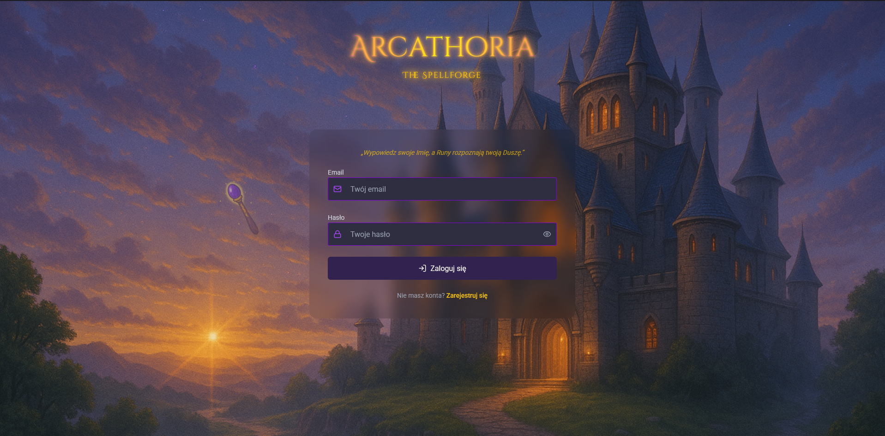

# Arcathoria Client

> Web client for the Arcathoria game built with React and Vite |
> Backend: [Arcathoria API](https://github.com/KrzychuuWEB/arcathoria-api)

---

## Description

Web client for the Arcathoria game built with React and Vite (SPA). In the game player can login, register, create
character, select character and init PvE combat and perform melee attack. I want to develop new features in the future.

## Features

- **Authentication:** Sign up and log in using JWT-based authentication
- **Character Management:** Create and select character
- **Combat Interface:** Initiate PvE Combat and perform attack
- **Form Validation:** Built with React-hook-form and zod
- **Notifications:** Real-time feedback with React Toastify
- **Progress Indicators:** Page loading indicators via `@tanem/react-nprogress`

## Coming soon features

- **Level system**
- **Skills system**
- **Reward system**
- **Equipment system**
- **Expedition system**
- **Spells creation system**
- **PvP system**
- **Resistance, buff, debuff system**
- **and more...**

## Stack

- React with Vite
- Typescript
- Tanstack/React Query
- React hook form
- React Toastify
- React NProgress
- React Router DOM
- Tailwind CSS
- Prettier
- Orval
- Zod
- Axios

## Environment Variables

Create a `.env` file in the project root:

## Installation & Running

1. **Clone the repository**
   ```bash
   git clone https://github.com/KrzychuuWEB/arcathoria-client.git
   cd arcathoria-client
   ```

2. **Install dependencies**
   ```bash
   npm install
   # or
   yarn install
   ```

3. **Generate orval**

    ```bash
   npm run codegen
   ```

4. **Start the development server**

Before starting the application, make sure the backend (with HTTPS + Caddy) is running as described in  
[DEV-SETUP.md](https://github.com/KrzychuuWEB/arcathoria-api/docs/DEV-SETUP.md) — this enables access via
`https://game.arcathoria.dev`.

**Run application**

   ```bash
   npm run dev
   # or
   yarn dev
   ```   

## Screenshots




